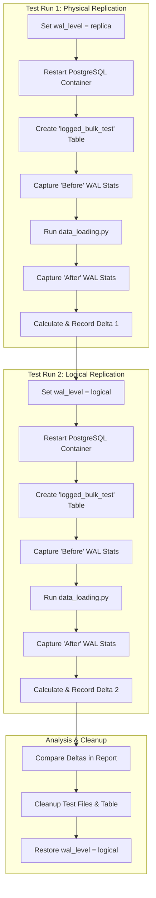

# Test Plan: Physical vs. Logical WAL Generation

**1. Objective**

To measure and compare the volume of Write-Ahead Log (WAL) data generated by an identical, high-volume insert workload under two different PostgreSQL `wal_level` configurations:
*   `replica`: The default level required for physical streaming replication.
*   `logical`: The level required for logical decoding, used by tools like Debezium.

**2. Hypothesis**

The `logical` WAL level will generate a significantly larger volume of WAL data (`wal_bytes`) compared to the `replica` level. This is because `logical` must contain not only the physical block changes but also a full logical representation of the row changes (`INSERT`, `UPDATE`, `DELETE`), which carries a higher overhead.

**3. Methodology**

We will reuse the existing `data_loading.py` script to perform the workload. The primary change between test runs will be modifying the `postgresql.conf` file and restarting the database container to apply the new `wal_level`.

Here is a Mermaid diagram outlining the test workflow:

**4. Detailed Steps**

1.  **Restore Test Files:** The `data_loading.py` and `setup_test_tables.sql` files from the previous test will be used.
2.  **Test Run 1: `wal_level = replica`**
    *   Modify `postgres-config/postgresql.conf` to set `wal_level = replica`.
    *   Restart the `postgres_db` container to apply the change.
    *   Execute `setup_test_tables.sql` to create a fresh `logged_bulk_test` table.
    *   Record the "Before" values from the `pg_stat_wal` view.
    *   Execute `data_loading.py` to insert 1 million rows.
    *   Record the "After" values from `pg_stat_wal`.
3.  **Test Run 2: `wal_level = logical`**
    *   Modify `postgres-config/postgresql.conf` to set `wal_level = logical`.
    *   Restart the `postgres_db` container.
    *   Execute `setup_test_tables.sql` again to ensure an identical starting point.
    *   Record the "Before" values from `pg_stat_wal`.
    *   Execute `data_loading.py`.
    *   Record the "After" values from `pg_stat_wal`.
4.  **Analysis & Reporting**
    *   Calculate the delta (After - Before) for `wal_records` and `wal_bytes` for both test runs.
    *   Create a new report, `physical_vs_logical_wal_test_results.md`, presenting the results in a comparative table.
    *   Provide a written analysis of the findings.
5.  **Cleanup**
    *   Drop the test table from the database.
    *   Remove the test scripts and the final report file using the `rm` command.
    *   Ensure `wal_level` is set back to `logical` in the configuration file to restore the project's original functionality.